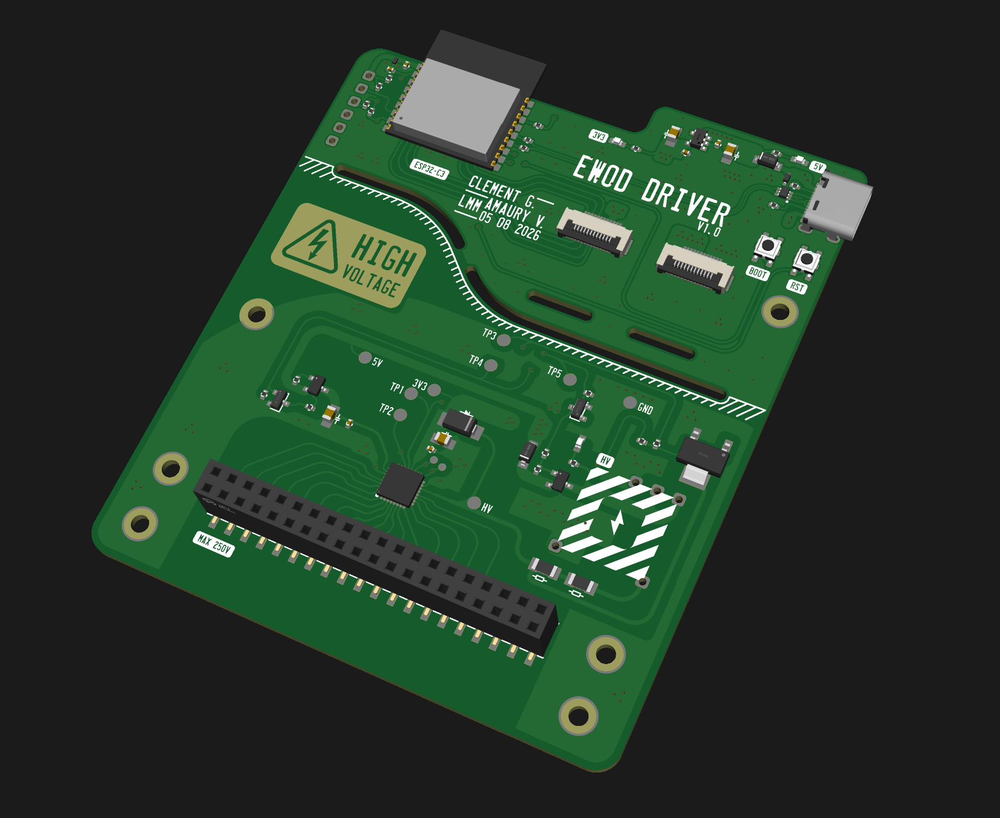
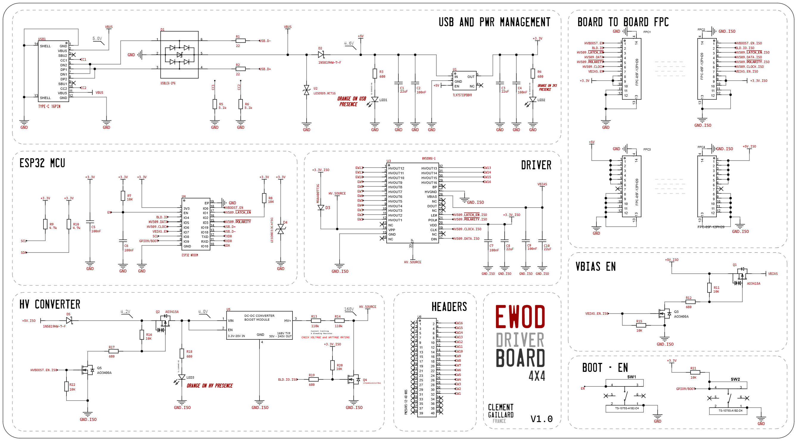
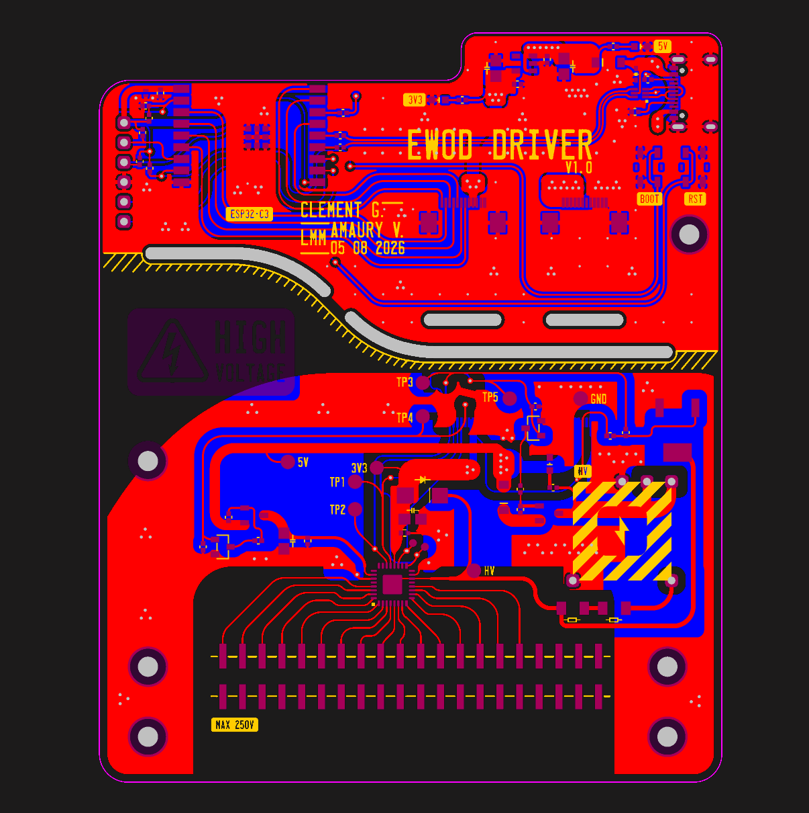
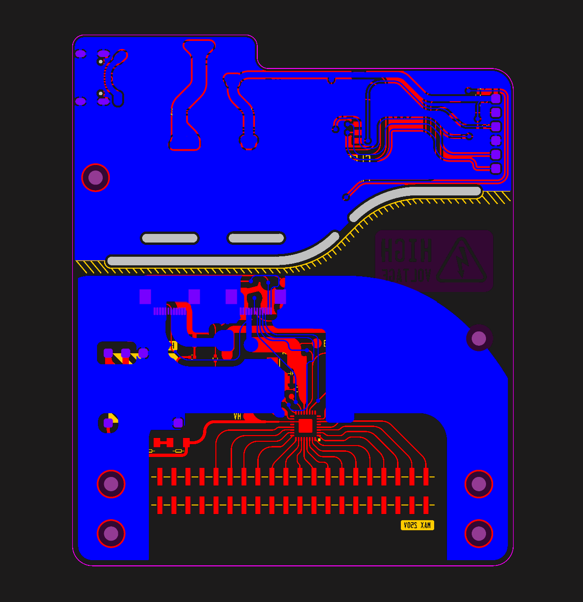

# MOVEA, an EWOD demonstration device

EWOD (ElectroWetting On Dielectric) is a fascinating process that moves droplets of water over an electrode array (dielectric as a medium), thanks to a high voltage (100+ V) applied between 2 adjacent cells (coplanar capacitance). **MOVEA** is a minimal 4x4 EWOD array with the complete driver board to demonstrate the basic principle of electrowetting. Based around an ESP32-C3, a DC DC boost converter module (168V OUT) as well as the HV509 driver IC. All inside a fully enclosed 3D printed device. 

> [!CAUTION]
> **HIGH VOLTAGE**
>
> This project generates high voltage (~168V DC) from the USB C to correctly drive the EWOD electrodes.
> While I tried my best to provide a fully enclosed design with the HV part being detachable from the MCU circuitry, the high voltage side remains **not galvanically isolated** from the MCU side. Treat the whole board as live whenever `HV OUT` is enabled, not just HV traces.
>
> The USB isn't galvanically isolated either, so it's recommended to fully disconnect the 2 FPC ribbon cables when programming the device to prevent any USB port damage in case of a failure. Controlling the device (droplet actuation) could then be done over WIFI.

> [!WARNING]
>
> **A few safety notes:**
> 
> Although I tried to design a fully enclosed device, the acrylic cover does not latch. Whenever high voltage is enabled, it is the user's responsibility to keep the acrylic door shut.
>
> I still added a 220k serie resistor right after the HV boost, which should limit the output current to completely safe levels of 700µA, but obviously the best practice is to not touch anything when the `HV` Rail is enabled.
>
> While the firmware demo already enforces this (could not be the case if a custom firmware is flashed). It is important to only enable the high voltage when actively actuating the droplets, and the `HV OUT` rail capacitors should be discharged in firmware after the HV module is disabled, to ensure `HV OUT` collapses instead of staying at 168V (the electrodes barely sink any current on their own). Collapsing `HV OUT` should obviously be done before switching the device off (because otherwise the N channel mosfet in charge of sinking `HV OUT` to ground won't conduct).

> [!WARNING]
> **No warranty, use at your own risk**: This project is provided as-is, without any guarantee of safety, correctness, or fitness for any purpose. If you do build, reproduce, adapt or take inspiration from this project, it's entirely at your own risk.
>
> I disclaim all responsibility for any damage, injury or other consequences arising from the use, reproduction, or modification of this design.

> [!NOTE]
> **Educational / demo purpose only** This project is intended for educational / demo purpose only, with no intent of being  used in actual lab experiments.

  

  
  

# What is EWOD?

Electrowetting is a fascinating branch of microfluidics, making possible to move droplets of water based solutions (µLiters of solutions) onto a flat surface without any mechanical part. EWOD has application in the biology industry (laboratories, ''lab on chip'') and in optical systems. By controlling each electrode with a 100+ V High voltage, the droplet position onto the EWOD grid can be controlled. 

# What this project aims to provide

This project is a minimal 4x4 EWOD device, with the FR4 EWOD array and the proper high voltage driver. The goal isn't to provide a finished lab-on-chip device with reservoirs and lab precision, but instead to obtain a small EWOD array that can move droplets on the 4x4 grid, showing the working principle of Electrowetting. Multiple dielectrics and different driving schemes could be used to evaluate different properties of electrowetting.

# Key features:

 - ESP32-C3 MCU
 - HV509 16 CH push pull HV driver
 - 3.3V-12V IN 168V OUT DC DC High voltage converter module
 - VIN enabled `HV OUT` rail (AO3415A P channel Mosfet)
 - 2x110k serie resistor directly on the HV boost output: should limit the current to a safe 750µA (in case of a downstream short circuit)
 - same 2x110k acting as bleeding resistors, sinking `HV OUT` to GND until the MCU disables it.
 - 2 FPC ribbon cables to be able to disconnect all HV related circuitry from the ESP32 devboard
 - detachable EWOD cartridge, that connects thanks to 2x20P 2.54mm Dupont Header pins.
 - 3D printed enclosure with acrylic cover to see the water droplet through the window.

# Schematic:

# Layout:

# Firmware:

A minimal demo code in C++ (Arduino IDE) is available to interface the HV509 as well as controlling the different power mosfets.

# Enclosure Assembly:

After 3D printing the different parts, cutting a 78.5mm long Φ 6mm steel rod and creating the acrylic window (2mm rectangle cut from an acrylic sheet, then bent with a hot air gun), the device can be assembled:
After connecting the 2 FPC ribbon cables, the PCB can be securely mounted to the enclosure thanks to threaded inserts added beforehand, and the HV cover can be glued in place (held in place with the 2 side rails). for the window, it's recommended to create a 'chain' with all the hinges placed on the enclosure with the rod in the middle, before glueing the acrylic window to the 3 hinge parts.

  

# Preparing the device

the following sequence is for safely programming the device, and preparing the EWOD array.

 - Before plugging any USB power source, make sure the 2 FPC cables are disconnected (only connected on one end, at the bottom side of the board)
 - The ESP32 part only can then be programmed over USB (completely disconnected from any HV related circuitry, thus ensuring no failure can damage the USB port). To do so, plug the USB C cable, hold the BOOT button, press the RST button, release BOOT then flash the firmware. Disconnect the USB cable.
 - Prepare the EWOD PCB: after adding a thin layer of low viscosity silicon oil (5cst), stretch a piece of ParafilmM to be applied over the electrode Array, then after adding an additionnal thin oil layer and plugging the array PCB on the device, a small droplet of water (barely larger than an electrode) can be pladed on the array, then discharged from any residual static charge with a GND wire
 - Carefully reconnect both FPC cables, and close the acrylic cover before reconnecting a USB power source

# Render:

# BOM

|Item                                  |Quantity|Designator                   |Value          |Manufacturer Part   |LCSC Part|Link                                                |Price [MOQ]   |Total Price (1 board & 5 cartridge)|
|--------------------------------------|--------|-----------------------------|---------------|--------------------|---------|----------------------------------------------------|--------------|-----------------------------------|
|MLCC 0805                             |4       |C1 C3 C8 C10                 |22uF           |CL10A226MP8NUNE     |C86295   |https://www.lcsc.com/product-detail/C86295.html     |$ 0.0537 [10] |$ 0.06                             |
|MLCC 0402                             |6       |C2 C4 C5 C6 C7 C9            |100nF          |CL05B104KB54PNC     |C307331  |https://www.lcsc.com/product-detail/C307331.html    |$ 0.0096 [100]|$ 0.96                             |
|USB ESD                               |1       |D1                           |               |USBLC6-2P6          |C15999   |https://www.lcsc.com/product-detail/C15999.html     |$ 0.2787 [5]  |$ 1.39                             |
|DIODE                                 |2       |D2 D5                        |               |1N5819HW-7-F        |C82544   |https://www.lcsc.com/product-detail/C82544.html     |$ 0.0568 [10] |$ 0.57                             |
|HV DIODE                              |1       |D3                           |               |MRA4007T3G          |C47921   |https://www.lcsc.com/product-detail/C47921.html     |$ 0.0942 [10] |$ 0.94                             |
|ESD DIODE                             |1       |D4                           |3.3V           |LESD8D3.3CAT5G      |C5563754 |https://www.lcsc.com/product-detail/C5563754.html   |$ 0.0090 [20] |$ 0.18                             |
|FPC Connector                         |4       |FPC1 FPC2 FPC3 FPC4          |               |FPC-05F-12PH20      |C2856799 |https://www.lcsc.com/product-detail/C2856799.html   |$ 0.1079 [5]  |$ 0.54                             |
|Orange LED                            |3       |LED1 LED2 LED3               |               |XL-1608UOC-06       |C965800  |https://www.lcsc.com/product-detail/C965800.html    |$ 0.0068 [100]|$ 0.68                             |
|P Mosfet                              |2       |Q1 Q2                        |               |AO3415A             |C133233  |https://www.lcsc.com/product-detail/C133233.html    |$ 0.1033 [5]  |$ 0.52                             |
|N Mosfet                              |2       |Q3 Q5                        |               |AO3400A             |C20917   |https://www.lcsc.com/product-detail/C20917.html     |$ 0.0849 [5]  |$ 0.42                             |
|HV N Mosfet                           |1       |Q4                           |               |IPN60R1K5CEATMA1    |C3288802 |https://www.lcsc.com/product-detail/C3288802.html   |$ 0.5529      |$ 0.56                             |
|Chip Resistor 0402                    |2       |R1 R2                        |22             |AC0402JR-0722RL     |C144722  |https://www.lcsc.com/product-detail/C144722.html    |$ 0.0027 [100]|$ 0.27                             |
|Chip Resistor 0402                    |6       |R3 R4 R12 R17 R18 R19        |680            |RC0402FR-07680RL    |C137948  |https://www.lcsc.com/product-detail/C137948.html    |$ 0.0054 [100]|$ 0.54                             |
|Chip Resistor 0402                    |2       |R5 R6                        |5.1k           |RC-02K512JT         |C453708  |https://www.lcsc.com/product-detail/C453708.html    |$ 0.0027 [100]|$ 0.27                             |
|Chip Resistor 0402                    |8       |R7 R8 R11 R15 R16 R20 R21 R22|10K            |RC0402JR-7W10KL     |C851859  |https://www.lcsc.com/product-detail/C851859.html    |$ 0.0045 [100]|$ 0.45                             |
|Chip Resistor 0402                    |2       |R9 R10                       |4.7k           |RC0402FR-074K7L     |C105871  |https://www.lcsc.com/product-detail/C105871.html    |$ 0.0043 [100]|$ 0.43                             |
|HV Chip Resistor 1206 200V 250mW rated|2       |R13 R14                      |110k           |RT1206BRD07110KL    |C870372  |https://www.lcsc.com/product-detail/C870372.html    |$ 0.073 [10]  |$ 0.73                             |
|Push-button                           |2       |SW1 SW2                      |               |TS-1075S-A1B2-D4    |C492872  |https://www.lcsc.com/product-detail/C492872.html    |$ 0.067[10]   |$ 0.67                             |
|3V3 LDO                               |1       |U1                           |               |TLV75733PDBVR       |C485517  |https://www.lcsc.com/product-detail/C485517.html    |$ 0.2067[5]   |$ 1.03                             |
|ESD DIODE                             |1       |U2                           |5V             |LESD5D5.0CT1G       |C7433850 |https://www.lcsc.com/product-detail/C7433850.html   |$ 0.0148 [50] |$ 0.74                             |
|HV Driver IC                          |1       |U3                           |               |HV509K6-G           |C633266  |https://www.lcsc.com/product-detail/C633266.html    |$ 4.3112      |$ 4.32                             |
|MCU                                   |1       |U4                           |ESP32 WROOM    |ESP32-C3-WROOM-02-N4|C2934560 |https://www.lcsc.com/product-detail/C2934560.html   |$3.2954       |$3.30                              |
|USB-C 16P                             |1       |USB1                         |               |TYPE-C 16PIN        |C2765186 |https://www.lcsc.com/product-detail/C2765186.html   |$ 0.0707 [20] |$ 1.41                             |
|Female Header PIN                     |1       |U6                           |2x20           |PM254VS-12-40-H85   |C5249780 |https://www.lcsc.com/product-detail/C5249780.html   |$ 0.6594      |$ 0.66                             |
|Male Header PIN (cartridge)           |1       |                             |2x20           |PZ254-2-20-S        |C3294478 |https://www.lcsc.com/product-detail/C3294478.html   |$ 0.4758      |$ 2.38                             |
|                                      |        |                             |               |                    |         |                                                    |              |                                   |
|BOOST converter                       | 1      | U5                          | 168V OUT      |                    |         |https://fr.aliexpress.com/item/1005009055927625.html|$ 10.25       | $ 10.25                           |
|                                      |        |                             |               |                    |         |                                                    |              |                                   |
|PCB Driver                            |1       |                             |               |                    |         |https://jlcpcb.com                                  |$ 8.37        |$ 8.37                             |
|PCB EWOD array                        |1       |                             |               |                    |         |https://jlcpcb.com                                  |$ 8.37        |$ 8.37                             |
|Metal Rod (hinge) Φ 6mm L >75mm       |        |                             |               |                    |         |https://fr.aliexpress.com/item/1005009347568195.html|$ 4.33        |$ 4.33                             |
|3D Printed enclosure                  |        |                             |               |                    |         |                                                    |              |                                   |
|2mm acrylic sheet                     |        |                             |(min 200x100mm)|                    |         |                                                    |              |                                   |
|                                      |        |                             |               |                    |         |                                                    |              |                                   |
|                                      |        |                             |               |                    |         |TOTAL                                               |              |$ 55.31                            |

